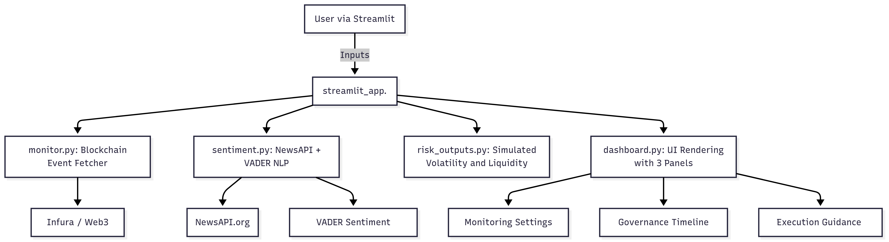

# Protocol Upgrade Monitor – Technical Documentation
1. **System Design and Architecture**
```bash
Streamlit UI  <-->  streamlit_app.py
                  |
     ┌────────────┴─────────────┐
     |                          |
 [src] Monitoring + Risk Logic  [ui] Dashboard Panels
 ```
- Event Monitoring: monitor.py fetches governance-related logs using web3.py.

- Sentiment Analysis: sentiment.py queries NewsAPI and applies VADER NLP.

- Risk Simulation: risk_outputs.py simulates volatility, liquidity, timing.

- UI Dashboard: dashboard.py displays monitoring settings, event timeline, and execution recommendations.




---

2. **Model Implementation Details**
Sentiment Engine:

- Uses VADER from NLTK

- Source: NewsAPI (title + description)

- Returns compound sentiment score ∈ [-1, 1]

- Fallback mock data if articles not found

Blockchain Log Decoder:

- Infura via HTTP Web3Provider

- compound_abi.json used to decode logs

- Filters by block range and contract address

Risk Score Model:
```bash
risk_score = (100 - sentiment * 50) + (max_votes / 1e6)
```
- Scales with negative sentiment or high voter weight

- Categorized into: Low, Medium, High

Simulations (Mocked for MVP):

- Volatility

- Liquidity Shifts

- Execution Window

- Rebalancing Suggestion

- Hedging Strategies

---

3. **Performance Benchmarks**
| Component  |	Runtime (avg) |	Notes |
|------------|----------------|-------|
|Web3 Log Fetch |	~1.2s	  | Fast if blocks limited|
|Sentiment Analysis	| ~1.5s	| VADER NLP is lightweight
|UI Load Time |	<2s	| Streamlit efficient
|Fallback Simulation |	~0.5s	|Fully mocked

---

4. **Optimizations**
- Cached fallback sample data to prevent reprocessing

- Environment-based API key loading for deployment

- Modular design for extension: replace mocks with GARCH/TVL models

---

5. **Future Work**
- Integrate Snapshot/Tally APIs for governance details

- Replace sentiment model with LLM-based (e.g., FinBERT)

- Add GARCH volatility models from arch or statsmodels

- Real-time event socket using Web3 websocket provider

---